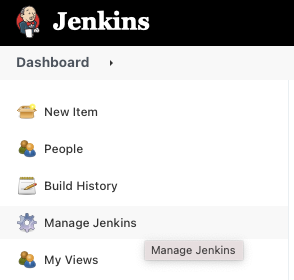

## Jenkins sending email 

### Installing Email Extended

When you install Jenkins, it will come with a plugin called the Mailer and mail Extension plugin, which will help you to send emails via Jenkins.

Go to Manage Jenkins > Manage Plugins > click on tab Available and search for ```mail Extension``` and ```Mailer plugin```


## Setup SMTP in Jenkins

Follow the below steps to configure SMTP in your Jenkins instance.

Goto manage Jenkins > configure systems



