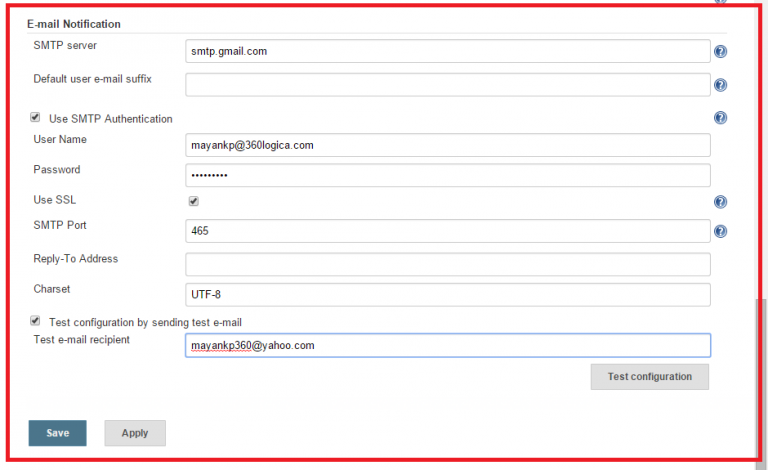

## Jenkins sending email 

### Installing Email Extended

When you install Jenkins, it will come with a plugin called the Mailer and mail Extension plugin, which will help you to send emails via Jenkins.

Go to Manage Jenkins > Manage Plugins > click on tab Available and search for ```mail Extension``` and ```Mailer plugin```


## Setup SMTP in Jenkins

Follow the below steps to configure SMTP in your Jenkins instance.

Goto manage Jenkins > configure systems


Scroll down and lookup for ””E-mail Notification”


Fill in the below details in SMTP configuration and click on the Save button.

For this demo, we will be sending an email to the Gmail account. As per the official documentation the SMTP host and port should be:

```
host:smtp.gmail.com
port: 465
```
Provide your email id and password in the SMTP authentication block and check the Use SSL button.

Check the email notification functionality by clicking the checkbox next to the ‘Test configuration by sending Test e-mail recipient’ option. Enter a valid email id and click the ‘Test configuration’ button to check whether the email id is valid or not.




For this demo, we will be using the Jenkins pipeline to write the Jenkins job. You can read the below blogs to understand Jenkins pipeline syntax better.


To create a pipeline job in Jenkins go to new item > click on pipeline and provide the job name and click on the OK button.


```
pipeline {
    agent any
    
    stages {
        stage('Ok') {
            steps {
                echo "Ok"
            }
        }
    }
    
    post{
        always{
           emailext attachLog: true, body: 'hai', subject: 'jenkins build pipeline', to: 'nikhil.s@ndimensionz.com'
        }
    }
    
```    
